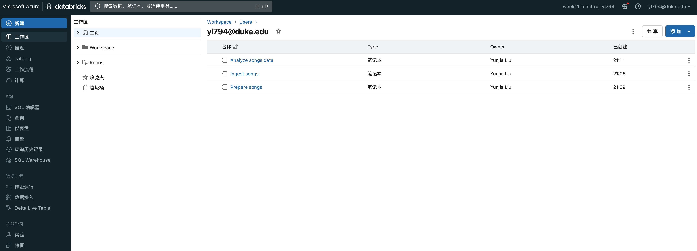
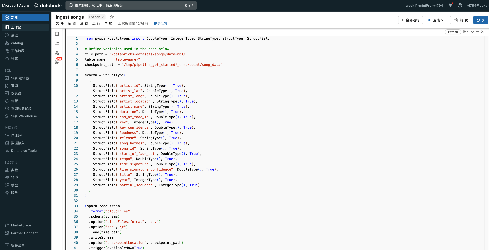
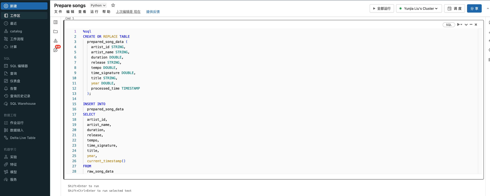
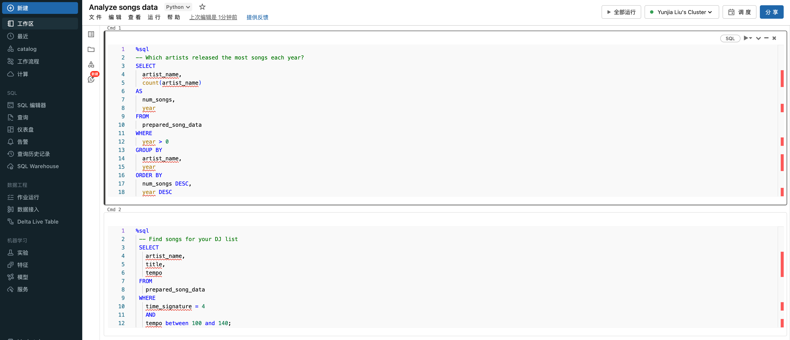
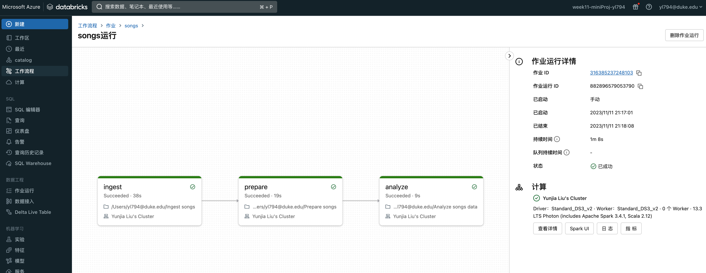
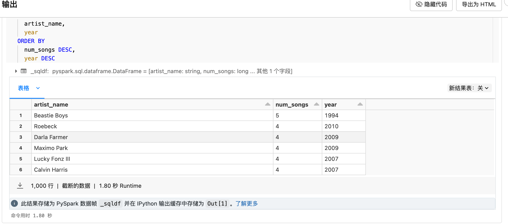
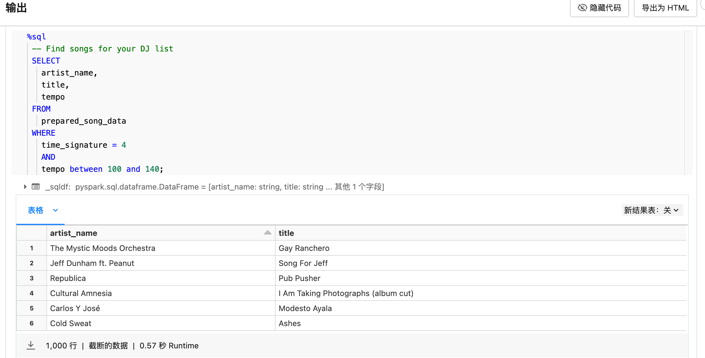

# Week11 mini Project 
The dataset used in this example is a subset of the Million Song Dataset, a collection of features and metadata for contemporary music tracks. In this project, I will create a azure databricks data pipeline to do ETL job on the dataset.
## Getting Started:

1. build a new workspace
2. create a new cluster
3. create notebook for code ingestion, preparation and analsis

4. create code ingestion:

5. create data preparation:

6. create data analysis:

7. create data pipeline and run:

## Result

